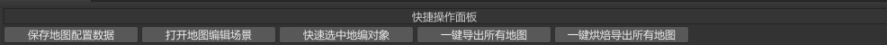

# MapEditor
此Github的目的是实现一个简易的地图编辑器工具。

需求:

1. 纯Editor地图编辑器，用于**场景编辑**和**数据埋点**。
2. 支持自定义场景对象数据和自由摆放场景对象进行场景编辑，场景对象支持**静态摆放**和**动态创建**两种。
3. 支持自定义**埋点数据**和**自由摆放埋点数据**进行数据埋点编辑。
4. 支持自定义调整场景大小以及场景地形指定和大小自动适配。
5. 场景数据和埋点数据支持导出自定义数据格式(比如Lua,Json等)。
6. 同一个场景支持编辑多个场景编辑和数据埋点。

实现思路：

1. 地图编辑器主要由**地图编辑器配置窗口**和**地图编辑器挂在操作脚本**Inspector组成。
2. 地图编辑器编辑数据分为两大类(1. **地图编辑** 2. **数据埋点**)。
3. 继承EditorWindow实现场景编辑和数据埋点的基础数据配置编辑。
4. 继承Editor自定义Inspector面板实现纯单个场景编辑和数据埋点操作。
5. 地图编辑操作通过挂在脚本(**Map.cs**)的方式作为单个场景编辑和数据埋点单位，从而实现单个场景多个场景编辑和数据埋点支持。
6. 场景对象编辑采用直接创建实体GameObject的方式，从而实现场景编辑完成后的场景可直接用于作为场景使用。
7. 场景对象编辑通过自定义Inspector面板实现快速删除和还原动态场景对象GameObject实现静态和动态场景对象的编辑和数据导出。
8. 数据埋点采用Gizmos(Monobehaviour:OnDrawGizmos())，Handles(Editor.OnSceneGUI())实现可视化编辑对象和相关数据显示，自定义场景大小配置网格显示也是用Gizmos实现。
9. 地图编辑器配置窗口用于配置基础的场景数据和埋点数据配置，**Map.cs**的挂在脚本通过自定义数据结构和自定义面板显示实现自定义数据配置。
10. **场景静态对象**相关数据通过挂在**MapObjectDataMono**脚本存储相关对象数据。
11. **场景动态对象**通过导出时**导出自定义配置数据**实现自定义数据导出。
12. 导出前通过**Map.cs**存储的数据构建自定义数据(**MapExport.cs**)实现自定义数据导出
13. 大地图暂定通过分块品抽的方式组装按需加载。

## 配置窗口

地图编辑器窗口主要分为4个区域：

1. **快捷按钮区域**
2. **自定义地图基础数据区域(e.g. 默认地图宽高)**
3. **地图对象配置区域**
4. **地图埋点配置区域**

### 快捷按钮区域



### 自定义地图数据区域


### 地图对象配置区域


### 地图埋点配置区域


## 操作编辑Inspector

操作编辑Inspector主要负责实现对地图编辑对象和地图编辑埋点的一些相关操作面板，可视化GUI数据绘制，地图编辑自定义基础数据配置以及一些快捷操作按钮。

### 基础数据配置区域


### 快捷操作按钮区域


### 地图对象编辑区域


### 地图埋点编辑区域


### 寻路烘培


### 数据导出

```json
{
    "MapData": {
        "Width": 8,
        "Height": 30,
        "StartPos": {
            "x": 0.0,
            "y": 0.0,
            "z": 0.0
        },
        "BirthPos": [
            {
                "x": 4.0,
                "y": 0.0,
                "z": 2.0
            }
        ]
    },
    ******
}
```

## 实战

效果图待添加

以上只展示效果图，详细的介绍参考下面的博客链接。

## 博客

[地图编辑器](http://tonytang1990.github.io/2024/04/23/%E5%9C%B0%E5%9B%BE%E7%BC%96%E8%BE%91%E5%99%A8/)