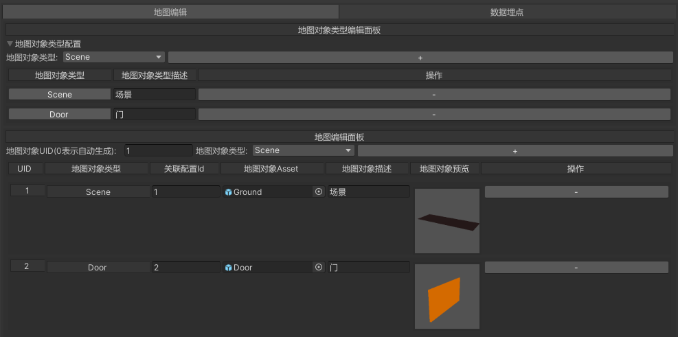
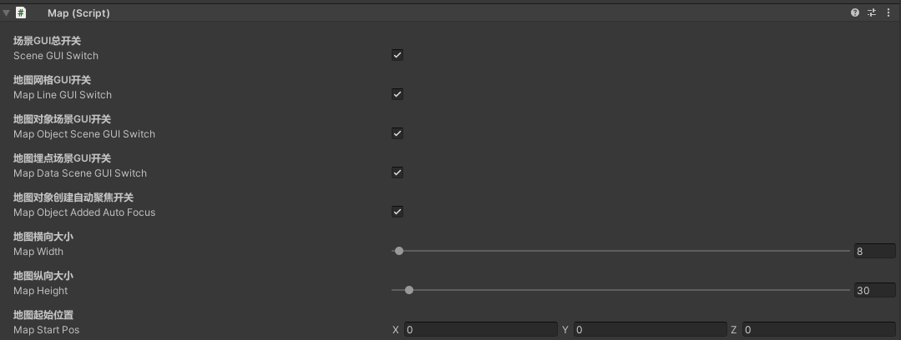
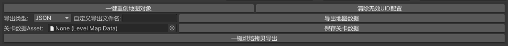
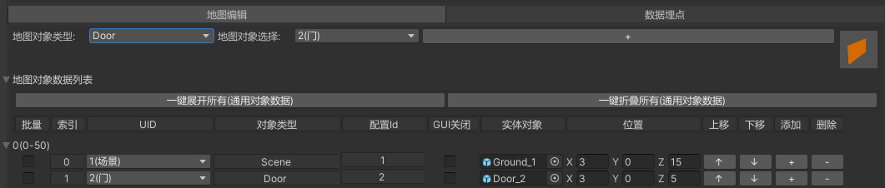
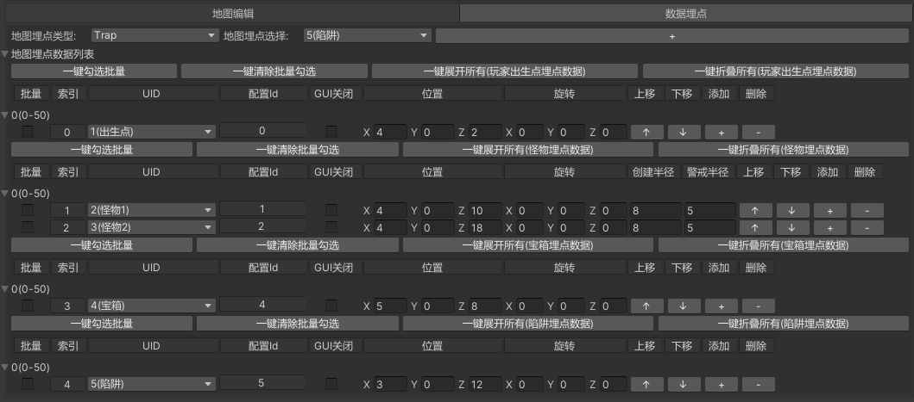
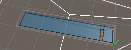

# MapEditor
此Github的目的是实现一个简易的地图编辑器工具。

需求:

1. 纯Editor地图编辑器，用于**场景编辑**和**数据埋点**。
2. 支持自定义场景对象数据和自由摆放场景对象进行场景编辑，场景对象支持**静态摆放**和**动态创建**两种。
3. 支持自定义**埋点数据**和**自由摆放埋点数据**进行数据埋点编辑。
4. 支持自定义调整场景大小以及场景地形指定和大小自动适配。
5. 场景数据和埋点数据支持导出自定义数据格式(比如Lua,Json等)。
6. 同一个场景支持编辑多个场景编辑和数据埋点。

实现思路：

1. 地图编辑器主要由**地图编辑器配置窗口**和**地图编辑器挂在操作脚本**Inspector组成。
2. 地图编辑器编辑数据分为两大类(1. **地图编辑** 2. **数据埋点**)。
3. 继承EditorWindow实现场景编辑和数据埋点的基础数据配置编辑。
4. 继承Editor自定义Inspector面板实现纯单个场景编辑和数据埋点操作。
5. 地图编辑操作通过挂在脚本(**Map.cs**)的方式作为单个场景编辑和数据埋点单位，从而实现单个场景多个场景编辑和数据埋点支持。
6. 场景对象编辑采用直接创建实体GameObject的方式，从而实现场景编辑完成后的场景可直接用于作为场景使用。
7. 场景对象编辑通过自定义Inspector面板实现快速删除和还原动态场景对象GameObject实现静态和动态场景对象的编辑和数据导出。
8. 数据埋点采用Gizmos(Monobehaviour:OnDrawGizmos())，Handles(Editor.OnSceneGUI())实现可视化编辑对象和相关数据显示，自定义场景大小配置网格显示也是用Gizmos实现。
9. 地图编辑器配置窗口用于配置基础的场景数据和埋点数据配置，**Map.cs**的挂在脚本通过自定义数据结构和自定义面板显示实现自定义数据配置。
10. **场景静态对象**相关数据通过挂在**MapObjectDataMono**脚本存储相关对象数据。
11. **场景动态对象**通过导出时**导出自定义配置数据**实现自定义数据导出。
12. 导出前通过**Map.cs**存储的数据构建自定义数据(**MapExport.cs**)实现自定义数据导出
13. 大地图暂定通过分块品抽的方式组装按需加载。

## 配置窗口

地图编辑器窗口主要分为4个区域：

1. **快捷按钮区域**
2. **自定义地图基础数据区域(e.g. 默认地图宽高)**
3. **地图对象配置区域**
4. **地图埋点配置区域**

### 快捷按钮区域


1. **保存地图配置数据** -- 用于确保我们在配置窗口的数据配置修改保存到本地ScriptableObject Asset
2. **打开地图编辑场景** -- 用于帮助我们快速打开辅助地图编辑的场景
3. **快速选中地图地编对象** -- 用于帮助我们快速选中当前场景里第一个带Map.cs脚本的对象，方便快速进入Map.cs的Inspector操作面板操作

### 自定义地图数据区域


**默认地图宽和默认地图长**用于配置默认创建的地图大小。

### 地图对象配置区域



1. **以UID作为唯一配置Id标识(不允许重复)，此Id会作为我们编辑器地图对象配置数据读取的依据。**

2. **通过MapObjectType指定地图对象类型。**

3. **通过定义ConfId(关联配置Id)实现关联游戏内动态对象Id的功能。**

4. **地图对象编辑通过定义Asset实现指定自定义预制件Asset作为实体对象的资源对象。**
5. **地图对象的是否动态是用于标识地图对象是静态摆放在场景里还是后续由程序动态创建的标识符。**
6. **描述用于方便用户自定义取名，方便识别不同的地图对象配置。**

Note:

1. **需要参与导出的地图基础配置数据如果修改了(比如是否动态，关联配置Id)，对应用到此基础配置数据的关卡都需要重新导出。**
2. **MapObjectType需要代码自定义扩展后，编辑器才有更多选项**

### 地图埋点配置区域


1. **以UID作为唯一配置Id标识(不允许重复)，此Id会作为我们编辑器地图埋点配置数据读取的依据。**
2. **通过MapDataType指定地图埋点类型。**
3. **通过定义ConfId(关联配置Id)实现关联游戏内动态对象Id的功能。**
4. **场景球体颜色用于配置地图埋点的GUI球体绘制颜色配置。**
5. **初始旋转用于配置地图埋点添加时的初始旋转配置(方便自定义大部分用到的初始宣旋转数据)**
6. **描述用于方便用户自定义取名，方便识别不同的地图埋点配置。**

Note:

1. **MapDataType需要代码自定义扩展后，编辑器才有更多选项**

## 操作编辑Inspector

操作编辑Inspector主要负责实现对地图编辑对象和地图编辑埋点的一些相关操作面板，可视化GUI数据绘制，地图编辑自定义基础数据配置以及一些快捷操作按钮。

### 基础数据配置区域



1. **场景GUI总开关** -- 所有绘制GUI的总开关
2. **地图线条GUI开关** -- 控制地图N*N的线条GUI绘制开关
3. **地图对象场景GUI开关** -- 控制地图对象相关的GUI绘制开关
4. **地图埋点场景GUI开关** -- 控制地图埋点相关的GUI绘制开关
5. **地图对象创建自动聚焦开关** -- 控制地图对象创建后是否需要自动聚焦选中
6. **地图横向大小和地图纵向大小** -- 用于控制我们需要编辑的关卡地图的大小，会影响默认地图或自定义地图的大小和平铺
7. **游戏地图起始位置** -- 用于控制关卡的起始位置偏移，方便支持自定义不同起始位置的关卡设置

### 快捷操作按钮区域



1. **清除动态对象显示按钮** -- 用于关卡编辑烘焙完成后，销毁需要程序动态创建的对象，制作只剩关卡静态对象的关卡预制件
2. **恢复动态对象显示按钮** -- 用于关卡烘焙时，还原所有需要参与烘焙的对象，从而烘焙出正确的寻路数据
4. **一键重创地图对象按钮** -- 用于我们更新了某些已经创建好的静态地图对象(脱离预制件关联)相关资源后一键确保使用最新资源创建
5. **导出地图数据按钮** -- 用于完成我们的关卡数据序列化导出
5. **保存关卡数据** -- 用于以ScriptableObject的序列化方式保存关卡数据(仅埋点数据)到本地(**实现埋点数据和关卡预制件分离，方便相同的关卡埋点数据能用于多个雷同的关卡预制件**)
6. **一键烘焙拷贝导出** -- 用于一键完成恢复动态对象+烘培寻路+拷贝寻路(默认拷贝到关卡预制件所在目录)+清除动态对象+导出地图数据操作

Note:

1. **烘焙寻路时所有动态对象必须显示着参与烘焙，生成关卡预制件时不需清除动态对象显示后应用到关卡预制件上**
1. **场景对象是否参与寻路烘培，通过修改预制件Layer和NavMeshSurface的寻路烘培的Layer决定**
1. **大部分操作在实体对象做成预制件后需要进入预制件编辑模式，所以部分操作会根据脚本所在实体对象情况决定是否自动进入预制件编辑模式**
1. **切换关卡数据Asset不仅会自动导入关卡的埋点数据，还会根据关卡数据Asset自动修改导出文件名，这样做是为了方便我们所有关卡都按照关卡数据为单位导出**

### 地图对象编辑区域



地图对象编辑通过选择**地图对象类型**和**地图对象选择**决定要添加的地图对象配置。

地图对象编辑和地图对象选择后面的**+**默认是**添加到地图对象数据列表尾部**。

地图对象数据列表后的操作可以对已经配置的地图对象数据进行相关操作，此处的**+**号是将选择的地图对象类型和地图对象选择**插入的当前数据位置**。

Note:

1. **动态对象最终由程序运行时创建，所以做成预制件时一定要记着清除动态对象的显示**
2. **动态对象通过地图对象配置面板配置的关联id导出给程序实现动态对象的配置关联**
3. **静态对象的数据关联是通过挂在MapObjectDataMono.cs脚本实现**

### 地图埋点编辑区域



地图埋点编辑通过选择**地图埋点类型**和**地图埋点选择**决定要添加的地图埋点配置。

地图埋点编辑和地图埋点选择后面的**+**默认是**添加到地图埋点数据列表尾部**。

地图埋点数据列表后的操作可以对已经配置的地图埋点数据进行相关操作，此处的**+**号是将选择的地图埋点类型和地图对象选择**插入的当前数据 位置**。

**地图埋点支持批量操作位置**，通过勾选批量选项决定哪些地图埋点数据要一起操作位置，然后操作(拖拽或者输入坐标)勾选了批量的地图埋点对象的位置，可以实现一起修改勾选了批量操作的地图埋点位置。

**一键清除批量勾选按钮** -- 用于快速取消所有已勾选批量的地图埋点数据

Note:

1. **地图数据的编辑和导出是按MapEditor脚本为单位。**
2. **地图埋点数据时通过Editor GUI(e.g. Handles和Gimoz)绘制的**
3. **地图埋点的位置调整需要按住W按键，旋转调整需要按住E按键**
4. **地图埋点支持配置自定义数据，这部分可以参考Monster和MonsterGroup埋点的自定义数据配置**
5. **地图埋点通过地图埋点配置面板配置的关联id导出给程序实现地图埋点的配置关联**
6. **自定义数据埋点可视化可以通过扩展MapEditor.cs实现自定义绘制**

### 寻路烘培



目前**场景编辑**是以**Map.cs**为单位。所以**寻路烘培**目前也是按**Map.cs所在预制件为单位**。

通过每个Map.cs所在GameObject挂在**NavMeshSurface**组件实现对当前GameObject的寻路烘培。

Note:

1. **NavMeshSurface设置Collect Objects为Children(只有子节点参与烘培)，参与烘培的Include Layers设置成自定义的实现是否参与烘培的Layer规则。**

### 数据导出

数据导出是通过点击**导出地图数据按钮**或者**一键烘培拷贝导出按钮**实现的。

**为了支持多种不同数据格式的导出，在数据导出之前我进行导出数据的定义和抽象(参见MapExport.cs)。**

```json
{
    "MapData": {
        "Width": 8,
        "Height": 30,
        "StartPos": {
            "x": 0.0,
            "y": 0.0,
            "z": 0.0
        },
        "BirthPos": [
            {
                "x": 4.0,
                "y": 0.0,
                "z": 2.0
            }
        ]
    },
    ******
}
```

Note:

1. **因为静态地图对象是跟随预制件一起加载的，所以导出的地图对象数据只包含动态地图对象相关的**
2. **扩展自定义配置数据需要自行扩展或继承MapObjectData或MapData和MapEditor.cs面板显示**
3. **扩展自定义导出数据需要自行扩展或继承BaseMapDynamicExpor或BaseMapDataExportt定义**
4. **自定义更多的动态对象数据导出通过继承BaseMapDynamicExport定义。**
5. **自定义地图埋点数据导出通过继承BaseMapDataExport定义**

## 实战

这里只简单放几张效果图，更详细的介绍参考下面的博客链接:

[地图编辑器](http://tonytang1990.github.io/2024/04/23/%E5%9C%B0%E5%9B%BE%E7%BC%96%E8%BE%91%E5%99%A8/)

效果图待添加

## 博客

